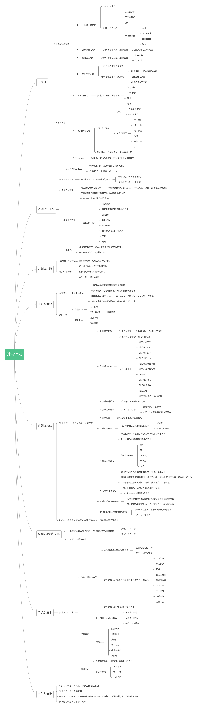

# 测试管理流程文档

## 测试计划

### 概述

测试计划是一份测试计划和管理的文档；

一些小型项目，一份测试计划就够了；一些大型的项目，则需要多个测试计划；

有些测试计划会管理跨多个项目的测试 ；有些测试计划则只会用在一个项目上；有些测试计划则是为某个特定的子过程编写的；

如果创建多个测试计划，那么就需要创建一个映射树，来阐明测试计划文档间的关系，以及每个文档间所包含的信息；

测试计划描述了在初始阶段所做的决策，且需要根据测试管理中的控制活动与时俱进；

### 文档结构

## 测试状态报告

### 概述

测试状态报告用于在特定报告周期内提供测试的状态信息；

在敏捷项目里面，可能不会写这种文档，直接在迭代会议上面沟通就完事了；

### 文档结构

## 测试完成报告

### 概述

测试完成报告对进行的测试进行总结；

可能是为整个项目写的，也可能是为某个子过程写的；

### 文档结构

