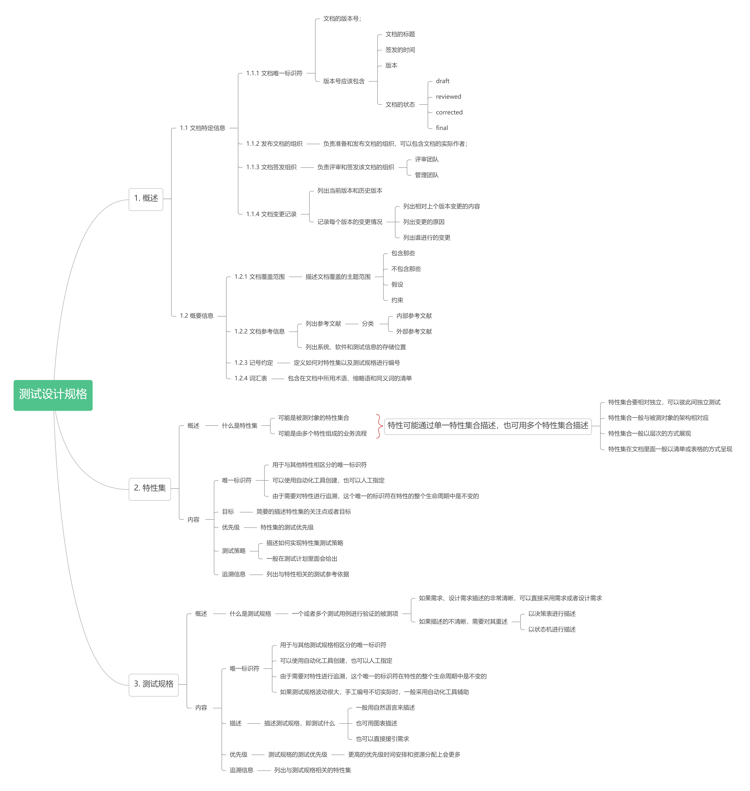

# 动态测试流程文档

## 概述

测试设计文档分为多个部分，它们之间的关系如上图。

## 测试设计规格

### 概述

列出要进行测试的特性以及相应的测试规格\(根据测试依据推导得到\)；

### 文档结构

## 测试用例文档

## 测试过程文档

## 测试数据需求

## 测试环境需求

## 测试数据准备报告

## 测试环境准备报告

## 实际结果

## 测试结果

## 测试执行记录

## 测试问题报告

