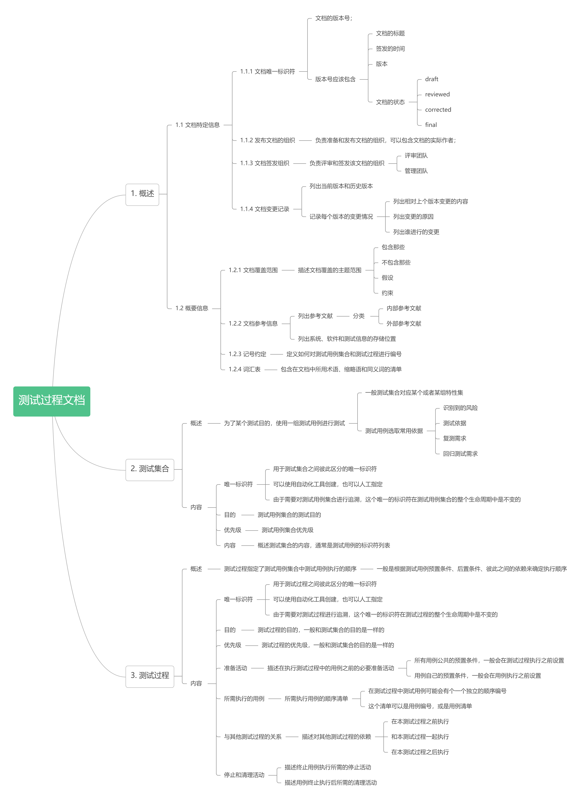

# 动态测试流程文档

## 概述

测试设计文档分为多个部分，它们之间的关系如上图。

## 测试设计规格

### 概述

列出要进行测试的特性以及相应的测试规格\(根据测试依据推导得到\)；

### 文档结构

## 测试用例文档

### 概述

测试用例文档里面列有测试覆盖项和相应的用例；

### 文档结构

## 测试过程文档

### **概述**

测试过程文档\(说白了就是测试套\)描述测试用例集合中测试用例执行前的初始设置、执行顺序、执行后的清理设置；

### 文档结构

## 测试数据需求

### 概述

测试数据需求文档描述了执行测试过程所需的测试数据的需求；

### 文档结构

## 测试环境需求

### 概述

描述要执行测试过程所需的测试环境需求；

可以统一定义测试环境，然后在测试环境需求报告里面引用；

### 文档结构

## 测试数据准备报告

### 概述

描述每个测试数据需求准备的状态；可以作为一个占位符存在测试数据需求报告中；

### 文档结构

## 测试环境准备报告

### 概述

描述测试环境的满足情况；

### 文档结构

## 实际结果

实际结果是测试过程里测试用例的执行结果；

实际结果常用来和测试结果相比较，确定测试结果是什么；

除了某些特殊的系统测试，通常不会对实际结果做正式的记录；

这些特殊系统如，安全要求高的、数据完整性要求高的、可靠性要求高的，才会对实际结果进行记录；

记录一般在测试执行时通过自动化工具完成；

一些测试用例的步骤可能要求记录中间结果，有的会把中间结果直接和实际结果记录在一起，有的会把中间结果记录在测试日志中；

有时候，会在Test Procedure的用例里为实际结果预留占位符，直接把实际结果记在这个里面；

## 测试结果

测试结果主要是通过比较实际结果与预期结果是否相符，从而判断并记录测试通过还是失败；

测试结果常见的类型有Pass\(实际结果与预期结果相符\)、Fail\(实际结果与预期结果不符\)、Block\(测试用例无法执行\)

测试结果一般记在测试过程中留的占位符中，因此测试结果通常不作为独立的文档而存在；

有时候测试过程是全自动化的，一般会用自动化工具自动填写；

## 测试执行记录

### 概述

记录测试过程执行的详细信息；

### 文档结构

## 测试问题报告

### 概述

本上下文中，问题报告记录在测试过程中发现的问题；

还有其他上下文的的问题报告，如，软件设计过程中的发现需求分析含混不清，生产过程中发现软件失效等等；

### 文档结构

