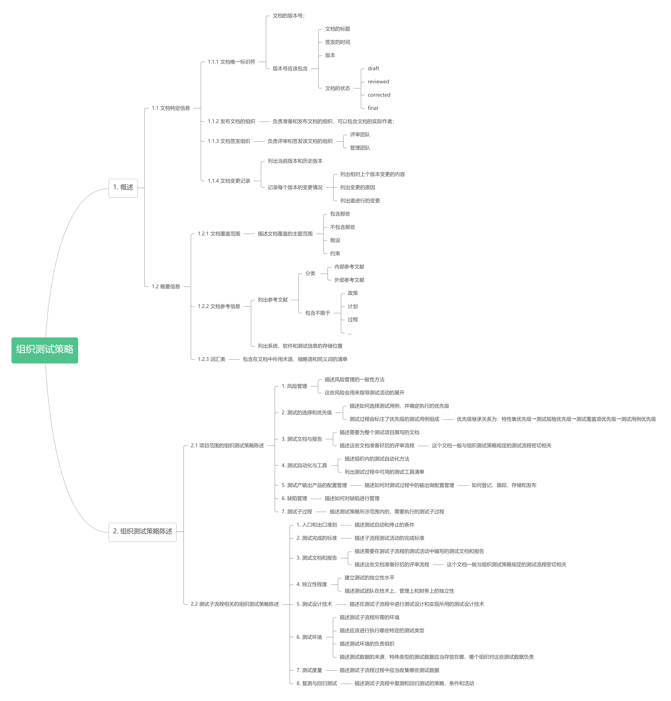

# 组织测试流程文档

## 概述

组织测试规范主要描述组织通用性的测试要求，而非某个具体项目的；

比较典型的组织文档是组织测试政策与组织测试策略；

## 组织测试政策

### 概述

测试策略定义了组织内软件测试的目标和原则；

它虽然定义了测试需要达成的目标，却没言明如何才能达成此目标；

但是它提供了一个框架来建立、评审和持续改进组织的测试策略；

### 文档结构

## 组织测试策略

### 概述

组织测试策略是一个技术文档，指导组织应该如何进行测试；即，如何达成测试政策规定的测试目标；

组织级测试策略是一个为组织内的项目提供指南通用型文档，而非具体的、项目相关的文档；

对于比较小的组织，或者业务单一的组织，通常一份组织测试策略就可以覆盖所有的测试活动；

如果组织的业务、采取的开发方式多种多样，那么通常就需要多份组织测试策略，

例如，企业有安全相关的产品、非安全相关的产品；开发模型采用敏捷模型、V模型；

业务足够大、特别重要的，可以设计专用的组织测试策略；

如果组织测试策略独一份，还可以直接把组织测试政策整合进来；

组织测试策略需要给出所有相关的子测试过程，并陈述各个子过程中采取的策略；

如果每个测试子过程的测试策略说明差异很大，可以为每个测试子过程单独弄一个章节；

### 文档结构

