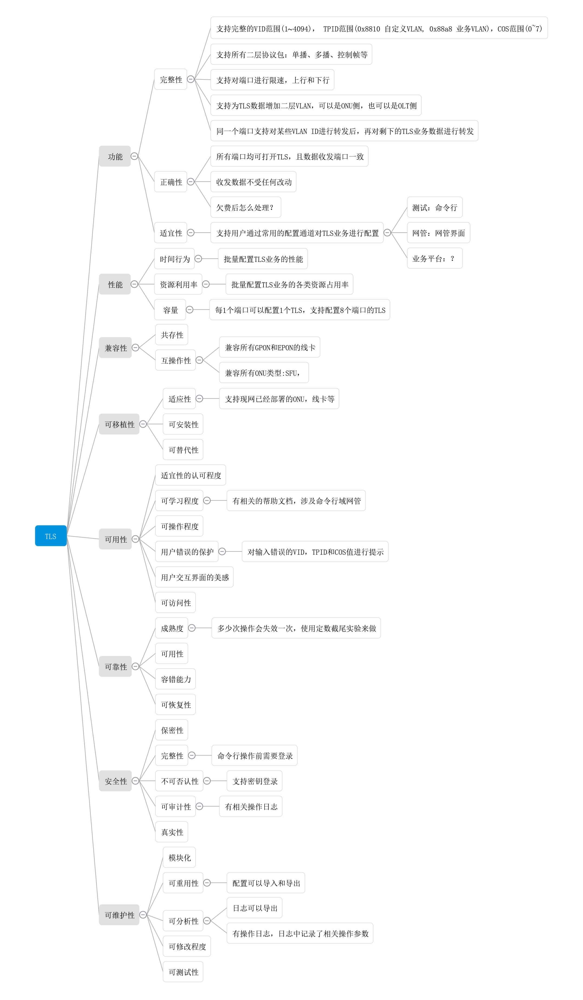

# ISO/IEC/IEEE29119-1

## 软件测试概述

### 软件测试的必要性

1. 决策者需要信息做决策；
2. 软件本身也难免出错；
3. 项目本身也需要验收也验证
4. 需要在项目的整个生命周期过程中对被测对象进行评估；

以上几个因素决定了必须要进行测试；

### 软件测试的目标

软件测试应该在成本和项目进度约束下，尽可能的在开发阶段的早期提供软件产品的质量信息、遗留风险信息，并找出尽可能多的缺陷；

### 产品质量

产品质量包含很多方面，比如，是否符合规范、无缺陷的情况、是否满足用户的需求；在ISO/IEC 25010 System and software quality models定义了8种可通过测试进行度量和评估的质量特征；详见子章节；

### 软件测试所提供信息的作用

这些信息可以有以下用途：

1. 通过发现和消除缺陷，改善被测对象的质量；
2. 提供质量和风险信息，用于决策；
3. 用于组织流程改进：哪些流程可以发现缺陷、哪些流程发现不了缺陷，从而对流程进行调整和优化；

### 测试注意事项

* 测试是一个由多个活动组成的流程，这个流程将输入转换为输出（测试过程在29119-2中有详细阐述） 
* 组织测试流程负责设置和维护测试政策\(Policy:a principle of action\)、测试策略\(Strategy:the best plan of action\)，并在组织层面的项目和功能中进行应用 
* 测试应该计划、监控和控制（测试过程在29119-2中有详细阐述） 
* 测试流程和子流程可以应用在任意的测试层级和测试类型上； 
* 每个测试都对应一个测试项目/被测对象； 
* 测试可以是静态的\(评审、走查、检视、静态扫码工具等）也可以是动态的；\(一些动态的测试流程在29119-2中有详细阐述）

* 验证\(Verification\)：评估产品、服务或系统是否符合规定、需求、规格或其他附加条件。多半是组织内部的流程。与确认形成对比； 
* 确认\(Validation\)：保证产品、服务或系统满足客户和其他已识别的利益相关者的需求。它通常涉及外部客户的接受度和适应性。与验证形成对比；

### 测试在验证及确认活动\(V&V\)中的角色

V&V活动有很多种，在IEEE 1012 and ISO/IEC 12207中有详细定义，如下图，29119系列标准所定义的软件测试部分只涉及中间的Testing；

### 穷尽测试不可能，启发式测试只能作为辅助

穷尽测试软件的每一个方面几乎是不可能的，因此需要基于风险的测试；

完全基于经验的启发式测试\(就是以前出错多就测试啥的那种\)不靠谱，用作测试设计的辅助还行，比如，错误猜测法、探索性软件测试方法里面运用这个办法；

## 在组织和项目上下文中的软件测试

### 标准与组织测试流程的融合

1. **融合标准中的测试流程** 凡是涉及到软件开发或集成的业务，都会定义和使用一套有效、高效、可重复使用的流程； 这个流程过程就叫软件生命周期流程；业务会把这套流程应用到项目的开发当中； 既可以将29119系列标准，用作整个组织的流程，也可以用作特定项目的流程； 在29119系列标准的基础上，组织可以增加自己必要的的流程，工具，政策等等； 在项目实施的过程中，如果组织有自己的流程，那么应该使用组织的流程； 如果组织没有自己的流程，可以使用本标准中的流程； 
2. **使用测试政策和测试策略** 一般大型的组织都有自己组织级的测试政策和策略，测试当然可以在没有这些东西的情况下进行，但是通常会非常低效； 
3. **软件测试是在上下文中进行的流程** 这句话有两个含义： 流程，表示软件测试应该计划、监控和控制； 上下文，表示测试受预算、进度、风险、组织文化、用户的预期、项目范围、测试资源的约束； 
4. **测试计划** 项目计划应该包含测试计划；测试计划应该体现组织的测试政策与测试策略，并且继承组织的各项测试指导方针，同时应该还要考虑到项目计划的约束； 测试计划应该体现项目的测试策略，以及项目的决策\(假设\)； 测试计划的主要工作就是评估各种测试需求，合理的调配测试资源；测试计划记录的就是这个分析的结果；评估测试需求采用的主要方式，就是通过风险分析；  一个项目通常有多个测试子流程，子流程均需要有相应的计划，这些计划里测试子流程的策略需要与项目的测试策略对齐； 
5. **多层上下文** 在组织层面，组织受到法律、法规、行业标准的约束；组织需要开发相关的测试政策和过程来满足这些需求，这就是组织的测试政策（Test Policy）；  到了项目这一级，项目在满足组织的测试政策的前提下，需要选择自己的软件生命周期模型，在选择生命周期模型之后，就开始制订项目的测试策略，有了项目计划和项目的测试策略就可以围绕它来制订项目的测试计划；  项目测试计划描述整体的测试策略，以及要使用的测试流程； 它通过明确测试目标、实践、资源和进度安排，来建立测试的上下文；同时，它还会识别一些子流程，如，系统测试、性能测试等等； 这些子流程还会在其子流程的测试计划中进一步的进行描述，会描述所采用的测试设计技术等等；  每个测试计划可能涉及一个或多个测试级别，或者涉及一个或多个测试类型；如，安全可能涉及到多个级别，系统测试可能涉及到多个类别；

### 三层测试流程模型

29119系列标准采用三层测试流程模型，分别是组织级测试流程，测试管理级测试流程和动态测试流程；

组织级测试流程，表示最高层级的测试规范，如，组织级的测试政策和策略；

测试管理流程是中间层，主要涉及项目测试管理、阶段测试管理和类型测试管理；

最底层的动态测试流程，主要设计一些动态测试的流程；  

#### 组织级测试流程

测试政策站在业务的角度表达组织对软件测试管理的期望和方法；

它主要是针对行政部门和高级管理者的；

测试政策还会指导组织测试策略和组织级测试流程的制定和执行；

如何创建、实现和维护组织的测试政策在组织测试流程中有详细的描述；

#### 测试管理流程

测试管理流程就是对项目风险进行识别和分析，对项目的约束进行考虑，同时参照组织的测试策略来制定项目的测试策略；

这个策略相对组织级别的测试策略会进一步细化，会定义静态、动态的测试活动，参与的测试人员，并在给定的约束下\(时间、资源\)，对测试的范围和质量做一个取舍；所有的这些都会在测试计划中进行记录；

在整个测试活动进行过程中，会监控所有进行的测试，确保测试活动按计划展开，以及所有的风险都进行了合适的处置，一旦需要变更测试活动，就需要对相关的测试流程和子流程进行控制；

在测试监视和控制过程中，一般会周期性刷新测试状态报告，来知会相关的测试流程的利益相关方；

项目汇总的测试结果会在项目的测试完成报告中进行体现；

**动态测试过程**

29119标准里面只对动态测试过程进行了定义 ，静态测试定义在IEEE 1028-2008 - IEEE Standard for Software Reviews and Audits中；

## 软件生命周期的一般测试过程

软件有从最初的概念阶段到退役的一个生命周期；

软件的测试活动就在这个生命周期中进行的；

关于软件生命周期的详细描述在ISO/IEC 12207里面有概述，在ISO/IEC 15288里面有详述；

软件生命周期由多个子软件周期组成；

从概念到第一次发布，常常叫做开发生命周期；开发项目负责管理和控制开发生命周期；

从产品首次发布进入运维阶段，系统会持续运营直到退役；运维阶段常常由多个不同版本的运维周期组成；

每个新版本都应该独立的看作一个独立的开发项目，并进行相应的测试；同时为之匹配相应的维护流程，保证系统可用，并如预期般运行；

就算没有对应的开发项目，有时候也会进行测试，比如 dry run的灾难恢复测试；

测试还可以用来评估要购买的软件是否满足业务需求。用于此方面的测试框架在ISO/IEC 25051中有定义；

### 在研项目流程以及其产出物

软件和系统开发一般由几个构件块组成；在软件工业中构件块常称之为阶段，或者开发子流程；

一般有需求工程阶段、架构设计阶段、详细设计阶段、编码阶段、集成阶段和准入等等；

每个阶段都会有一些输出，可以是高度结构化的， 也可以半结构化的，也可以是非结构化的；

每个输出都可以是潜在的被测对象；

### 在维项目流程以及产出物

进入到运营阶段，就需要对软件进行持续的维护；

维护项目和开发项目一般大不同；比如，维护的预算一般是根据维护的周期来拨付的；

在维项目流程的目标一般是保证系统达到一个可接受的可靠性、可用性程度；

通常维护项目通常定期发布版本修复一些缺陷，或者立即发布版本修复个别特别高优先级的缺陷；

### 软件生命周期的支撑流程

在组织中，支撑流程是用来辅助软件开发生命周期的；

典型支撑流程有：质量保证、项目管理、配置管理、过程改进等

#### 质量保证流程

质量保证流程是一个有计划的、系统性的支撑流程和活动，以确保流程或者产品满足既定的技术或者质量要求；

质量保证通过在项目流程中运用一些合适的方法、标准和工具来达成这一目的；

质量保证会使用测试结果或者其他一些信息来对设计、计划和执行的问题进行调查、分类和报告；

在测试过程中，收集度量信息，从而了解测试过程和被测对象的质量信息，知晓质量保证在每个项目中的应用的效果；

#### 项目管理和测试

项目管理指的是项目计划和控制过程中的支撑流程；

它包含测试项目的管理；

测试活动的评估、风险分析和计划应与项目总体计划对齐；

在测试项目过程中，测试经理需要不断收集和分析测试活动的相关信息，并与项目经理进行沟通；

沟通的结果可能会变更、更新项目计划等等，这些同时还会影响测试计划；

当测试子流程或者测试项目完成后，会生成一份完整的报告，概述其过程和结果，提交给项目经理；

#### 配置管理和测试

配置管理主要用来建立和维护工作产品的完整性；

一般在配置管理实际使用开用之前，先对配置管理系统测试一下，看看其是否满足组织和项目的需求；

放入到配置管理系统中进行管理的项目叫做配置项，它是事件驱动的，相互彼此独立，完全基于其他流程的需求进行的；

配置管理流程通常包括这些环节：

* 给配置项分配唯一的标识符；
* 受控状态下进行存储；
* 释放审计；
* 变更控制；
* 状态报告；

三层测试流程模型均可以用上配置管理：

* 在最上层的组织测试流程中，它所输出的测试政策、组织级测试策略可以作为配置项进行管理；
* 在测试管理流程中，可以把项目测试计划的依据项目计划纳入配置管理系统中；
* 在动态测试流程中，可以测试规格所依据的需求纳入到配置管理系统中；

下面列举了一些典型的可管理的文件：

* 组织级的测试规范。如，测试政策，组织级的测试报告；
* 测试计划；
* 测试规格；
* 测试环境配置项。如，测试工具、测试数据、数据库、驱动、桩等等；

#### 过程改进和测试

过程改进就是采取措施，改变组织的流程，更快更好的达成组织的商业目标；

过程改进和测试流程在以下两个地方有相互的交集：

* 测试流程提供过程改进所需的信息；
* 测试流程本身可以进行过程改进；

当测试流程提供信息用于过程改进时，这个活动一般发生在项目级测试管理流程中；

当改进测试流程本身时，一般是在组织级这个层面进行的，通过各种手段收集相关数据，然后找到所需改进的测试流程，实施改进，并监控改进效果；

## 基于风险的测试

穷尽测试是很难做到的，实际测试过程中往往采样的方式进行；

各种测试概念\(例如：实践、技术和类型\)的存在可以帮助选择适当的样本进行测试，这些样本将在本标准中进行讨论和概述。

本标准的前提就是使用基于风险的方法，在给定约束下，选择最佳的测试方法；

这些都是通过依据这些风险对用户、开发人员的影响，来识别不同测试策略的相对价值来实现的；

基于风险测试的关键在于高优先级风险的被测对象要给予重点的测试；

在ISO/IEC 16085 Risk Management标准中有关于如何确定风险的介绍；

风险可以使用多种方法归类。例如，不满足法规的风险、不满足合同的风险、项目进度相关的风险、输出不满足预期行为的风险；

当进行风险分析的时候，风险分析可以对风险进行识别和评分，从而这些被识别出来的风险可以进行评分、优先级排序、分类并进行处理；

### 在组织策略中应用基于风险的测试

组织测试政策设定了组织测试的上下文；

组织的测试政策可以通过制订一些组织层面的测试流程、测试策略、测试方法来应对测试风险；

除此之外，还可以搞一些方法在测试管理活动中管理风险；

### 在测试管理流程中应用基于风险的测试

在测试管理流程中，根据收集得到的风险清单确定要进行哪些测试，一般通过测试计划中的测试策略进行体现：

* 风险评分高的一般采取更多的测试；
* 风险的优先级往往决定了测试的优先级；
* 风险的类型一般对应测试级别或类型。组件之间交互的风险对应集成测试，软件难用的风险一般对应易用性测试；

一般最佳的实践是：  
  1. 从各方广泛收集和识别风险；  
  2. 采取相应的风险应对措施；  
  3. 把存留风险作为交付的风险知会给各方人员；

风险清单会随着测试的执行和业务的变化自然的产生变化，因此基于风险的测试应该看作一个动态的过程，要时时刷新；

### 在动态测试流程中应用基于风险的测试

风险清单常用于指导动态测试流程：

* 可以根据风险选择最恰当的测试设计技术；
* 可以根据风险的优先级确定做何种详细程度的测试分析；
* 可以根据风险的高低确定特性集、测试规格和用例的优先级；

动态测试流程本质是一个风险应对活动；执行测试用例就是在应对风险；

通过测试，表明风险发生的可能性比较低；无法通过测试，表明风险发生的可能性比较高；

测试问题报告流程用来确定问题是测试用例导致的，还是需要进一步的调查；

## 测试子流程

测试项目由多个根据测试策略制定的子测试流程所组成；

这些测试子流程针对特定质量属性在软件开发生命周期的各个阶段进行测试；

每个测试子过程都用测试管理流程进行管理。即，测试计划、测试监控和测试完成；

测试计划第一步是明确测试目标、范围、以及与子测试流程相关的风险；

在明确了目标、范围和风险之后，会依据这些信息来制订测试策略，如是否需要静态测试、动态测试等；

一般而言，项目级测试策略所概述的策略可以直接作为子测试流程的测试策略；特殊情况下，需要子测试流程需要制定详细的测试策略；

子测试流程首先需要明确测什么和不测什么；确保测试范围是明确的，被大家所理解；

子测试流程往往会进行多轮动态或者静态测试；

即使子流程中只包含一轮某种测试类型的测试，往往也需要执行多轮，确保测试对象最终满足测试标准；

重复执行的动态测试往往称之为回归测试。执行回归测试的主要目的是确保在修复问题的同时，不引入新的问题；

测试项目中子测试流程的数量取决于测试策略，以及整个项目生命周期阶段的数量；

不受项目开发生命周期模型的影响，即瀑布模型、迭代模型不影响子测试流程的数量；

### 测试目标

测试主要要达成以下目标：

* 为风险管理活动提供相关的信息；
* 提供产品质量的相关信息；
* 评估产品质量是否满足用户的需求；
* 评估缺陷是否被修复，且为引入新的缺陷；
* 评估是否满足法律法规等需求；

完成测试以满足特性、特性集的测试目标；

特性集的类型决定了需要执行何种类型的测试；

特性有需要满足的质量特性；特性的质量特性组合确定需要执行哪些类型的测试来满足测试的质量目标；

### 被测对象

所有在SDLC中的产物都可以作为被测对象；

被测对象可以是需求、系统、组件或代码，也可以是计划文档、架构 、详细设计文档、用户手册、甚至是测试用例；

### 对质量特征进行测试

在《ISO/IEC 25010 System and software quality models》中概述了软件的质量模型；

这个软件质量模型一共描述了8种质量特性\(请参考子章节：ISO25010质量模型\)；

测试需要对被测对象中重要的质量属性进行度量，即，发起相应的子测试流程；

当制定测试计划的时候，测试经理不仅需要考虑所有的质量特性，还需要把测试重点放在差异化的质量特性上；如，银行系统强调安全、安全相关的应用强调稳定；

### 测试依据

测试依据是制定测试计划、进行测试设计、实现测试用例和进行测试管理的依据；

在软件开发生命周期的不同阶段，测试依据形式各不相同；

测试依据一般来自：

* 标准文档；
* 法律法规；
* Checklist；
* 用户需求；
* 历史问题；
* 架构设计文档；
* 详细设计文档；

等等

### 复测和回归

在测试管理流程中的完成环节中往往会涉及到两种类型的测试：复测和回归测试；

* 复测主要是用来验证修复问题的解决方案是否确实修复了Bug； 复测一般就是把触发问题的用例重新执行一遍；不过，为了让复测更快更好，常常会对触发问题的测试规格进行识别，分析后，编写新的用例进行复测；
* 回归测试主要是验证修复没有引发新的问题；

在做测试计划的时候，要考虑测试完成环节中需要进行复测和回归测试；

### 测试设计技术

之所以有测试设计技术，是为了更快更好的发现缺陷；

可以把测试技术理解为对应某种缺陷类型的最佳实践；

#### 静态测试设计技术

静态测试是测试的一种形式，主要是发现文档或源码中的明显缺陷；

在测试策略中往往会包含静态测试；

静态测试技术分很多种：

* 静态代码扫描
* 可追溯性分析
* 评审

等等；

具体采取哪种静态测试技术，和被测对象的类型关系不大，主要是和风险有关，风险越大，越倾向于采取更加形式化的静态测试方法；

静态测试中的评审方法，除了有查找缺陷的作用外，还可以作为沟通的一种方式；

在IEEE1028:2008中定义了一些常见的评审技术：

#### 动态测试设计技术

动态测试设计主要涉及识别测试规格，梳理测试覆盖项，输出并执行测试用例；

根据如何分析输入参数来对测试设计方法进行分类，可以分为以下三类：

* 基于规格的测试设计：测试用例的输入和输出均来自测试依据；
* 基于结构的测试设计：测试用例是分析被测对象的结构特征而来，如代码结构、菜单结构；
* 基于经验的测试设计：根据测试人员的经验而来，如错误猜测法、探索性软件测试法等等；

具体采取测试设计中的哪种方法，取决于被测对象风险的大小；

## 测试实践

### 基于需求的测试

基于需求的测试就是把需求作为测试的依据；

之所以采取基于需求的测试方法，主要是为了确保被测对象实现了对应的需求，满足用户的期望；

采取基于需求的测试方法时，会遇到以下问题：

* 需求描述混乱、不清晰：需要需求管理系统对澄清之后的需求进行管理；
* 投入不足，无法对所有需求进行全面的覆盖：这时需要根据需求的优先级对测试进行规划；

在项目交付中，单纯的基于需求的测试是不够的，往往需要结合其他的测试手段来应对项目中的风险；

### 基于模型的测试

基于模型的测试就是用模型对被测对象的行为进行建模，然后把这个模型作为生成测试用例的依据；

常见的模型有：

* [数据流图](https://en.wikipedia.org/wiki/Data-flow_diagram)
* [控制流图](https://en.wikipedia.org/wiki/Control-flow_diagram)
* [依赖图](https://en.wikipedia.org/wiki/Dependency_graph)
* 状态迁移图
* 决策表
* ATDD、BDD、TDD模型

生成模型后，有两种办法生成用例，一种是在测试执行之前把根据模型提前生成好用例；一种是在执行时根据模型动态生成用例后，立即执行；

一般建模需要工具支持。BoardCom提供了Agile Requirements Designer软件对需求进行建模，然后根据模型自动生成覆盖所需的用例；Cucumber提出了Behavir Driven Test，使用Gherkin语言对需求进行建模，然后使用BDD自动化框架，快速的把模型转换成自动化测试脚本；安全测试中，使用STRIDE建立安全模型，然后进行测试；

### 基于数学的测试

所谓基于数学的测试，就是采取数学工具对输入参数进行抽样；

基于数学的测试方法有很多，主要有：

* 组合测试\(Combinatorial testing\);
* 随机选取测试用例进行测试\(Random test case selection\);

在测试覆盖上，往往还是用统计学里面的取样方法构造测试覆盖项：

* 分层抽样\(Stratified sampling\)；
* 模糊测试\(Fuzzing Testing\)；
* 聚类抽样\(Cluster sampling\)；
* 基于专家的判断进行抽样\(Expert judgment sampling\)；

在使用基于数学的测试时，往往需要自动化工具进行辅助；

### 基于经验的测试

基于经验的测试主要是基于：

* 以前的测试经验；
* 对特定软件或者系统的了解；
* 领域知识；
* 依据之前项目的质量信息；

对被测对象进行测试；

29119-4里面只提到了错误猜测法，其实基于经验的测试除了错误猜测法以外，还有探索性软件测试、即兴测试和软件攻击测试等；

基于经验的测试往往对文档要求不高，也不编写用例，只会对测试做个大概的记录；

### 脚本和非脚本化的测试

非脚本化的测试省去了测试设计与实现环境，上来就直接开搞，速度更快；但是由于缺乏用例，很呐这种测试方法，主要用在低风险的被测对象上；

脚本化的测试正好相反

## 测试自动化

## 缺陷管理

