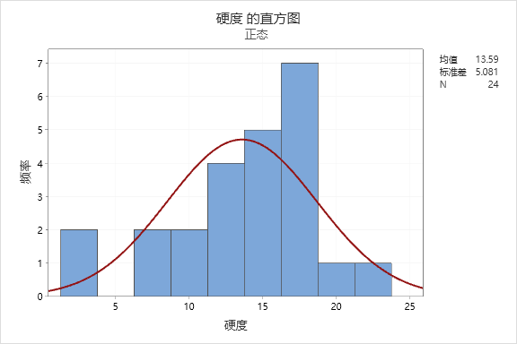
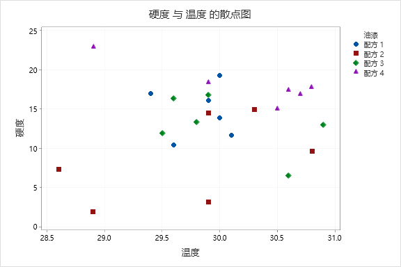

# 描述统计学

## 概述

描述统计学常用图和表呈现数据；

* **表** 常用 频数分布表、交叉频率分布表；
* **图** 常用 直方图、散点图；

对数据主要进行如下分析：

* **集中和分散情况** 集中情况常用 平均数、中位数、众数指标 等 分散情况常用 标准差 等 
* **与常态分布的偏离情况** 观察中心点的偏离用偏度，观察高度的偏离用峰度 
* **观察个体在整体中的位置** 常用百分位数，Z Score和T Score

## 基本概念

* **总体**  把研究对象的全体（包括有形的和潜在的）称作**总体**，其中每个成员称为**个体**。常用随机变量XX来刻画一个总体（或者总体的特征值） 
* **样本**  
  获取样本主要有两种办法，普查和抽样；

  * 普查 主要是需要对一个个个体进行调查，时间费用较高，而且不适合破坏性的实验；
  * 抽样

    从主体抽取个体进行观察，一次抽取的个数叫样本量、样本容量，一次抽取的结果叫样本；

* **简单随机抽样** 抽样一般采取简单随机抽样的办法进行，它具备两个特征：
  * **随机性**  
    样本都有等概率的机会被选中，即以每个个体的抽取均符合该分布  

    > “二战”期间，为了加强对战机的防护，英美军方调查了作战后幸存飞机上弹痕的分布，决定哪里弹痕多就加强哪里，然而统计学家瓦尔德\(Abrahom Wald, 1902–1950\)力排众议，指出更应该注意弹痕少的部位，因为这些部位受到重创的战机，很难有机会返航，而这部分数据被忽略了。事实证明沃德是正确的。

    > 这个案例就是因为抽样的时候不具备随机性，即只抽取了成功返航的，没有抽取没有返航的，所以在样本抽取的时候要注意“幸存者偏差”的影响；

  * **独立性** 每个样本的选取时独立的

## 常用图表

### 频率分布表

频率分布表实际上就是对单变量进行计数；可以直接计数，也可以统计其所占百分比，也在其基础上进行累计计数；

频率分析最早用来破解古典密码\(即简单的字母替换的密码\)；

描述统计学中，频率分析往往是分析的第一步；

使用频率分布表来观察数据的集中情况，通过频率分布表可以大致观察到众数、中位数、算术平均数和加权平均数等集中性指标；当然，也可以大致观察到分离指标；

* **MiniTAB进行频率分布分析** 使用MiniTAB很容易生成频率分布表；首先，新建工作表录入数据；接着，点选**“统计”-“表格”-“单变量计数”**；然后选择要统计的数据即可；  选择统计哪一列\(1\)，怎么统计\(2\)，然后保存即可\(3\):

### **频率交叉分布表**

* **MiniTAB进行交叉频率分析** 频率分析表只能分析单个变量的频率，有时候需要分析两个数据成对出现的频率，就需要使用交叉频率分析表；

### 直方图

直方图适合原始数据，即没有使用过频率分布表统计过的数据；

生成直方图往往使用以下方法：

1. 把数据的最大值减去最小值
2. 确定要分成多少组，从而确定分组区间
3. 对数据进行分组频率统计
4. 根据统计结果制作频率分布直方图

* **MiniTAB生成直方图** 使用 图形-&gt;散点图-&gt;简单 生成直方图； MiniTAB还可以生成带正态分布拟合的散点图\(图形-&gt;散点图-&gt;包含拟合\)，如下图所示

### 散点图

散点图适合观察数据；即可以观察原始数据，也可以观察已经分组过的数据；

* **使用MiniTAB对交叉频率分析结果使用散点图呈现** 使用图形-&gt;散点图-&gt;简单-&gt;选择X、Y轴 没有进行过频率分布分析的数据，要先进行频率分布分析

* **使用MiniTAB对原始数据使用散点图呈现** 使用图形-&gt;散点图-&gt;简单-&gt;选择X、Y轴， 分组

### **参考资料**

### [《Minitab教程 Minitab频率分布，交叉制表分析数据》](http://www.ruanjianba.net/2020/course_0530/10081.html)

## 数据分析

### 集中和分散分析

### 与常态分布偏离分析

### 观察个体在整体中的位置

### 异常值检测

