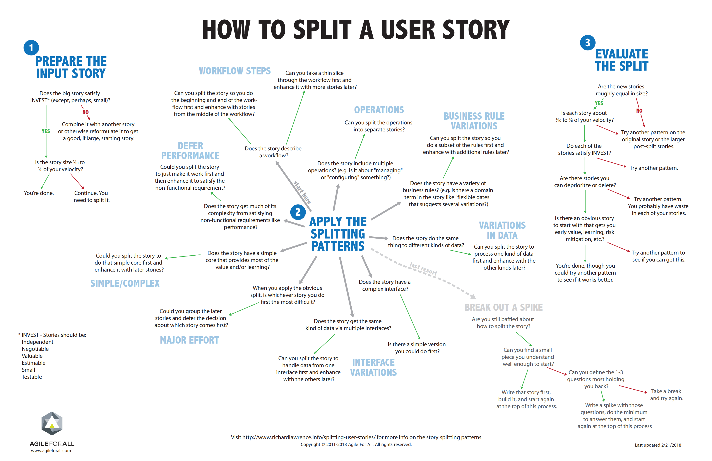

# 实例化需求

## 概述

以往各种需求分析，无论是非结构化的还是UML这种结构化的，最终下来效果都不怎么好；

随着敏捷开发模型的流行，业界目前提出了实例化需求分析的方法，它是需求工程方法的一种；

采用这种方法分析和形式化描述的需求，非常具体，同时对测试用例的设计有非常大的帮助；

## 分析流程


### User Story环节

主要是确认需求的价值

模式为：

什么特性，谁将从这个特性里面获得好处，什么好处

### Discovery环节

主要对澄清需求，从而确定系统的行为

模式为：

Story Slicing， 需求过大时，对需求进行切分

Example Mapping， 使用Story-Rule-Example，Question的方法，不断澄清需求

### Formulation环节

主要是对澄清完毕的需求，进行形式化的描述

模式为：

Story，使用As a - I want - so that模式描述

Rule-Example，使用Feature + Scenarios组合描述

Example，使用Scenario里面的Given-When-Then进行描述

Formulation完成后，形成如下文档:

```text
Feature: Title (one line describing the story/feature)
    As a    [role]
    I want  [feature]
    So that [benefit]

    Scenario: Title1 (for Behaviour 1)

        Given [context or setup]
        And  [some more context]...
        When [event occurs]
        Then [expected outcome]
        And  [another outcome]...

    Scenario: Title2 (for Behaviour 2)
        ...
```

### Automation环节

主要是对Gherkin描述的结构化需求，实现自动化

## Story

早期的瀑布模型里面， 采用形式化或者半形式化的方法记录和描述需求，但是这种方法除了显著的增加成本以外，并没有特别好的解决需求模糊不清的问题，而且在快速改变的业务中，这些个需求调整起来也费劲。

为了解决这个问题，敏捷开发的先驱们在这个地方进行了变革，发明了以下方法。

围绕需求的价值，提出了最原始的思考模型，即，什么特性，谁将从这个特性里面获得好处，什么好处

> The _**feature**_ that needs to be discussed The _**role**_ that will get the benefit from the feature The _**benefit**_ that is expected

这就是最早的User Story，后来慢慢的出现了形式化的描述：

```text
As a <type of user>
I want <capability>
so that <business value>
```

## Discovery

有了User Story之后，就要开始对其进行分析， 类似于要把OR转换成SR，分析方法称为Discovery

在Discovery阶段，遵循一个原则，叫做 Last Responsible Moment。核心的意思就是，越晚做决策越好，因为那个时候获取的信息越多，越不容易导致返工。

在实际操作中，一般遵循如果不到开发这个需求的时候，就不要浪费时间去分析他；在需求设计时，见招拆招，别整那些今后可能用不上的功能。

### Exmaple Mapping

现实往往是不完美的，往往会出现accidental discovery, 即，开始设计了，发现有事没考虑到。

为了尽可能的减少accidental discovery造成的变更，就需要进行Deliberate discovery，即对需求进行深思熟虑的分析。要进行深思熟虑的分析，就需要专注去分析那些我们未知的问题，而不是已知的问题。

怎么进行缜密的分析呢？

在敏捷团队里面， 往往采取的活动叫做

backlog grooming / refinement meetings

即，需求的梳理和改进会

说了这么多，对于Delibrate Discovery最好的办法是一项叫做Example Mapping的活动，如下图（另行介绍）


### Story Slicing

但是，无论怎么MECE，无论怎么Example Mapping，只是尽可能的消除返工的风险，而不是消灭。

因此，敏捷采取了一种分散风险的办法，就是快速迭代。

通过快速迭代，快速的收到反馈，而尽早改进，加深对产品的认知。

为了快速的进行迭代，敏捷里面就采取了一个措施，叫做Story的转换：

把 大的Story\(Epic, Large User Story\)， 转换为， 小的Story\(Detailed Small Increment\)

一旦分解完毕， 小的Story，就可以拉到Backlog看板上面进行开发。

这个时候，Story主要是用来设计时参考和追溯用的。

这个Story不同于编码、测试等任务，它是一个可进行项目管理的价值单元，它具备**I**ndependent **N**egotiable **V**aluable **E**stimable **S**mall Testable特征。

至于小的Story要多小，一般要考虑事务性成本，一个特性开发完毕要走流程，这些都是成本。

至于怎么切分Story，都有套路，下面图示是其中一种：



## Example Mapping详解

### Story不是设计需求，Feature才是

Story不是设计需求

转换后的Small Story也不是设计需求， Small Story也不是设计需求

他们用于 发现需求， 发现需求所得到的 Feature List， 即特性清单才是设计需求

Feature List描述了系统的行为：


这里解释下Story、Rule、Example的概念：

* **User story**

  用户对需求的描述

* **Rule \(a.k.a. acceptance criteria\)**

  系统所需要实现的行为，来满足用户的需求

* **Concrete example**

  使用Context-Action-Outcome组合举例澄清系统应当有什么行为

Feature使用Gherkin结构化描述，如下图所示：


怎么把一个Story转换成Feature呢？ 主要使用Example Mapping的方法

### Example Mapping转换法

Example Mapping需要组织如下的活动：


思考（Story、Rule、Example）→ 提问（Question）→ 回答（Rule、Example）

对照着当前已有的Story、Rule、Example思考

提出自己的问题Question

以Rule、Example的形式回答，无法回答的问题，放在一侧，可以在下次讨论时给出

在Cucumber Studio里面提供了 Example Mapping的支持：


Example太多怎么办？

1. 去重
2. 归类

为了使得思维尽可能的缜密，一般使用麦肯锡的MECE方法：

Mutual Exclusive， Collaborative Exhausted

为了使得Rules尽可能地全面，一般使用6大质量维度的思考法

转换之后，得到的东西如下形式：

```text
# Rule
Feature: Subscribers see different sets of stock images based on their subscription level
 
# Example
Scenario: Free subscribers see only the free articles
  Given Free Frieda has a free subscription
  When Free Frieda logs in with her valid credentials
  Then she sees a Free article on the home page

# Example
Scenario: Subscriber with a paid subscription can access both free and paid articles
  Given Paid Patty has a basic-level paid subscription
  When Paid Patty logs in with her valid credentials
  Then she sees a Free article and a Paid article on the home page
```

Rule标签， 对应Feature字段

对Example的概述，或者是特性的约束， 也是AT验收的准则

Example标签， 对应Scenario字段

使用Given， When， Then语法描述

注意：描述专注于系统的行为，而非实现

## 工具支持

### 需求分析[SpecMap](https://specmap.cc/)

需要使用Example Mapping方法分解需求的时候，除了使用Cucumber Studio，还可以使用[SpecMap](https://specmap.cc/)


### Gherkin形式化记录SpecFlow

[https://specflow.org/](https://specflow.org/)

## 自动化实现

有多种自动化实现框架, Python一般使用Behave框架；

